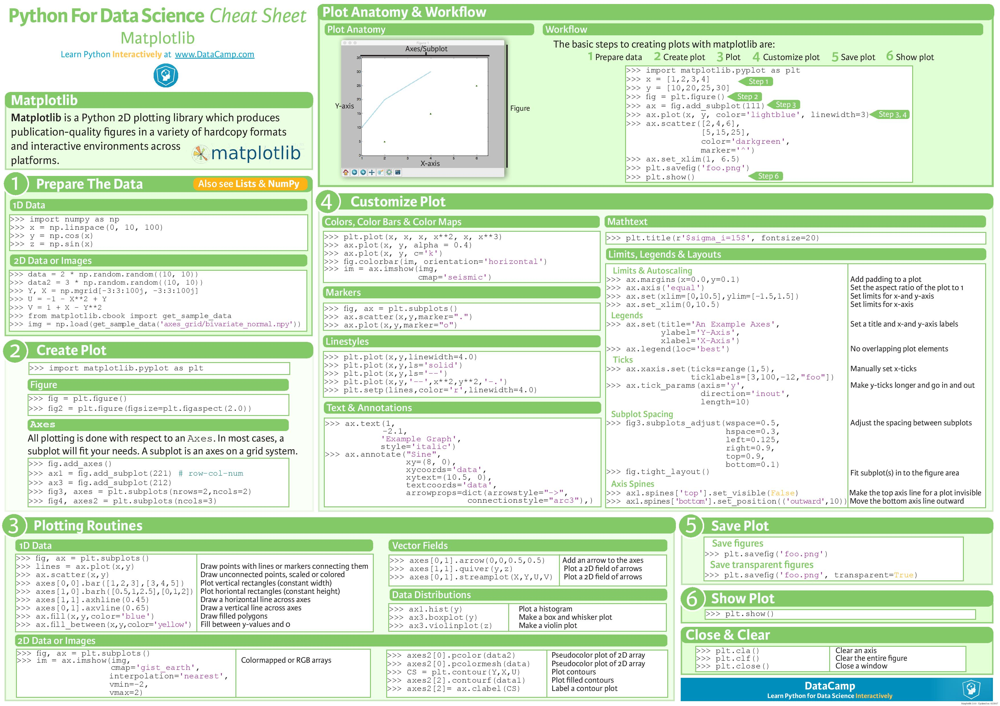

# Matplotlib Tutorial

Matplotlib is a comprehensive library for creating static, animated, and interactive visualizations in Python.Matplotlib produces publication-quality figures in a variety of hardcopy formats and interactive environments across platforms. Matplotlib can be used in Python scripts, the Python and IPython shell, web application servers, and various graphical user interface toolkits.

Matplotlib provides numerous ways to create static, animated and interactive visualizations. It is the most popular plotting library for Python. It works easily with both NumPy and Pandas arrays. Seaborn, which I'll cover in my next tutorial futher extends Matplotlib, but it is very important to learn both.

You can install it with the command : conda install matplotlib or pip install matplotlib

<a href="https://matplotlib.org/gallery/index.html">Matplotlib Chart Gallery</a> is a great page to go to when you are looking for information on making a specific chart type.

