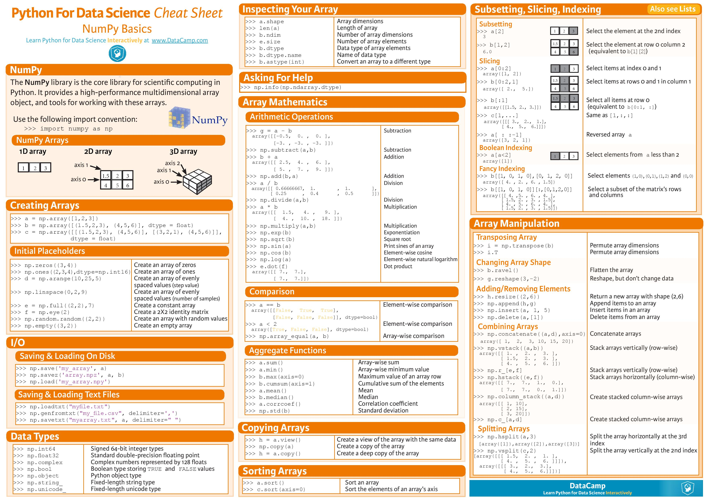

# NumPy Tutorial

NumPy is an amazing scientific computing library that is used by numerous other Python Data Science libraries. It utilizes vector (1D Arrays) and matrice arrays (2D Arrays), contains many mathematical, array and string functions that are extremely useful. Along with all the basic math functions you'll also find them for Linear Algebra, Statistics, Simulation, etc.

I recommend that you use the Jupyter setup and use with Anaconda so that you'll have access to all of NumPys dependencies.

