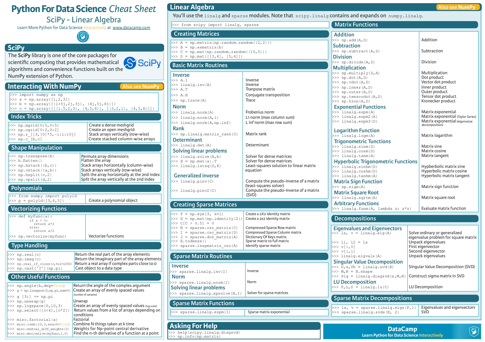

# SciPy Tutorial

SciPy is an open-source Python library which is used to solve scientific and mathematical problems. It is built on the NumPy extension and allows the user to manipulate and visualize data with a wide range of high-level commands.

SciPy contains modules for optimization, linear algebra, integration, interpolation, special functions, FFT, signal and image processing, ODE solvers and other tasks common in science and engineering.

## Jupyter Notebook User Guide / Cheatsheet
